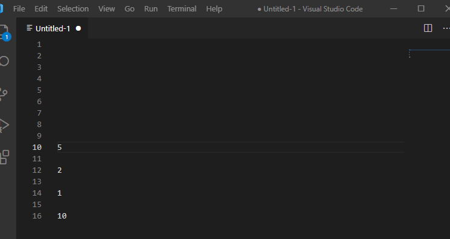

# Multiply All
  

Lightweight extension for VS Code that enables users to multiply 1 or more selected numbers by a single common factor.

## Features

* Can be used for both single-selection and multi-selection multiplication
* Use the default Keyboard Shortcut or Command Palette to automatically multiply all selections by any numerical input of your choice 

## Usage
After making your selection(s), you can use the default keybind (Ctrl+Shift+8) or the Command Palette to be prompted for a scale factor. As long as all of the selections contain only numbers, it will multiply each of the selected numbers by the input and replace the selections with the new values.

## Upcoming Features
* Configuration option for setting custom precision

## Issues
Submit any [issue](https://github.com/mujundi/vscode-multiply-all/issues) if you come across a bug or have a suggestion.

